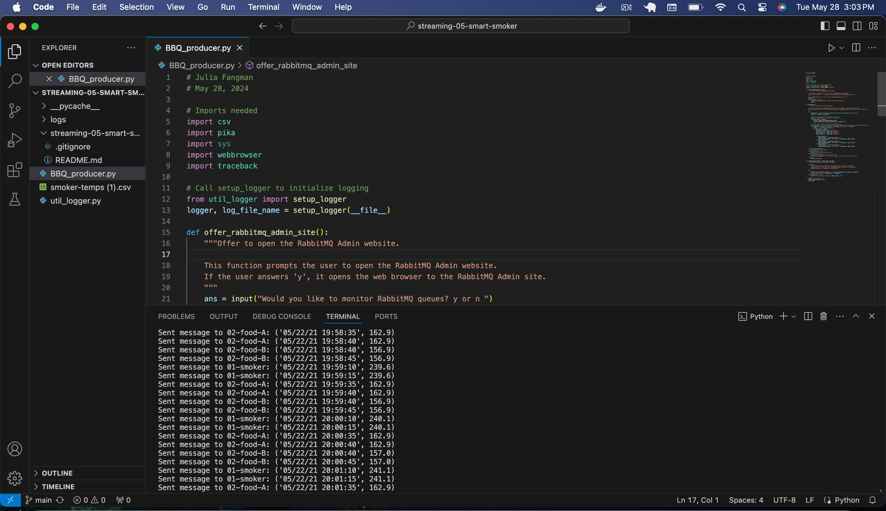
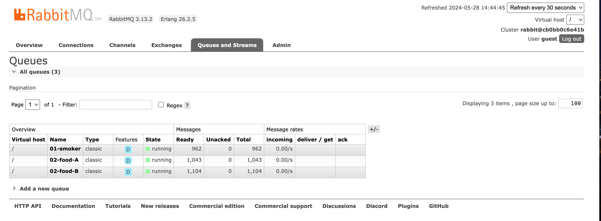
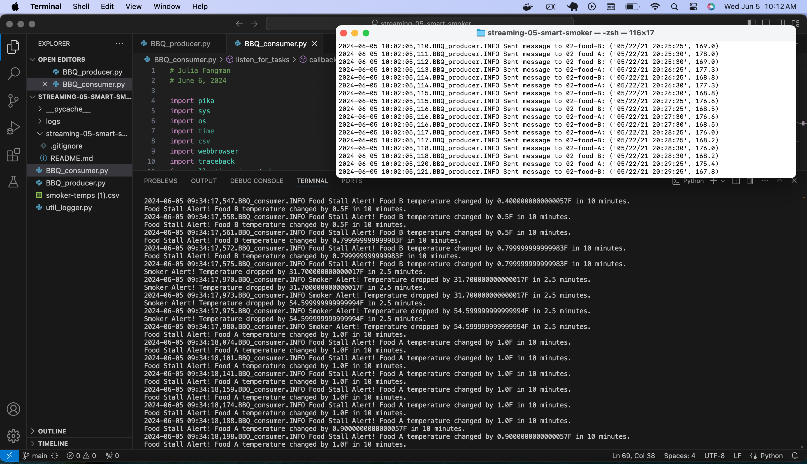

# streaming-05-smart-smoker 
## Julia Fangman    May 28, 2024

### The Problem / Challenge To Solve
We want to stream information from a smart smoker. 

smoker-temps.csv has 4 columns:

[0] Time = Date-time stamp for the sensor reading
[1] Channel1 = Smoker Temp --> send to message queue "01-smoker"
[2] Channel2 = Food A Temp --> send to message queue "02-food-A"
[3] Channel3 = Food B Temp --> send to message queue "03-food-B"

We want know if:

The smoker temperature decreases by more than 15 degrees F in 2.5 minutes (smoker alert!)
Any food temperature changes less than 1 degree F in 10 minutes (food stall!)
Time Windows

Smoker time window is 2.5 minutes
Food time window is 10 minutes
Deque Max Length

At one reading every 1/2 minute, the smoker deque max length is 5 (2.5 min * 1 reading/0.5 min)
At one reading every 1/2 minute, the food deque max length is 20 (10 min * 1 reading/0.5 min) 
Condition To monitor

If smoker temp decreases by 15 F or more in 2.5 min (or 5 readings)  --> smoker alert!
If food temp change in temp is 1 F or less in 10 min (or 20 readings)  --> food stall alert!

##### Requirements
RabbitMQ server running
pika installed in your active environment
RabbitMQ Admin
See http://localhost:15672/Links to an external site.

### Before you Begin: 
1. Fork this starter repo into your GitHub.
2. Clone your repo down to your machine.
3. View / Command Palette - then Python: Select Interpreter
4. Select your conda environment.
5. Make sure to import pike or copy the file from a previous module

### Task 1. Create a Place to Work
1. In GitHub, create a new repo for your project - name it streaming-05-smart-smoker.
2. Add a README.md during the creation process. (If not, you can always add it later.)
3. Clone your repo down to your machine. 
4. In VS Code, add a .gitignore (use one from an earlier module), start working on the README.md. Create it if you didn't earlier.
5. Add the csv data file to your repo. 
6. Create a file for your bbq producer.

### Task 2. Design and Implement Your Producer 
Here's how the code works:

1. Imports: The script imports necessary libraries such as csv, pika (RabbitMQ client library), sys, webbrowser, and traceback.

2. Logger Setup: The script initializes logging using a custom function setup_logger from util_logger module. This helps in logging errors and other information for debugging purposes.

3. RabbitMQ Admin Site: The function offer_rabbitmq_admin_site() prompts the user to open the RabbitMQ Admin website. If the user chooses to do so, it opens the web browser to the RabbitMQ Admin site.

4. Main Work: The main_work() function is the core of the script. It performs the following tasks:
- Establishes a connection to the RabbitMQ server running on localhost.
- Deletes any existing queues named "01-smoker", "02-food-A", and "02-food-B" and then declares new queues with these names.
- Processes a CSV file containing smoker temperature data.
- For each row in the CSV file, it extracts the timestamp, smoker temperature, food A temperature, and food B temperature.
- If the smoker temperature is available (not empty), it converts it to a float and sends a message to the "01-smoker" queue.
- Similarly, if food A or food B temperatures are available, it converts them to float and sends messages to the respective queues.
- If any errors occur during these operations, they are caught and logged with detailed traceback information.
  
5. Send Message: The send_message() function is responsible for publishing a message to the specified RabbitMQ queue. It takes parameters channel, queue_name, and message, where channel is the communication channel to RabbitMQ, queue_name is the name of the queue to publish the message to, and message is the content of the message to be sent.

6. Main Block: Finally, in the main block, the script offers to open the RabbitMQ Admin site and then calls the main_work() function to perform the necessary tasks.

 

 

### Requirements:
In your callback function, make sure you generate alerts - there will be a smoker alert and both Food A and Food B will stall. 

Your README.md screenshots must show 4 concurrent processes:

Producer (getting the temperature readings)
Smoker monitor
Food A monitor
Food B monitor
In addition, you must show at least 3 significant events.

Run each terminal long enough that you can show the significant events in your screenshots:

Visible Smoker Alert with timestamp
Visible Food A stall with timestamp
Visible Food B stall with timestamp
