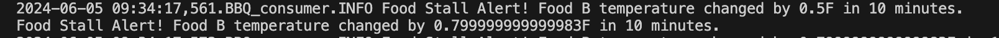

# streaming-05-smart-smoker 
## Julia Fangman    May 28, 2024

### The Problem / Challenge To Solve
This project implements a temperature monitoring system for a BBQ smoker and food items. The system consists of a producer script that reads temperature data from a CSV file and sends it to RabbitMQ queues, and a consumer script that processes the data, detects temperature anomalies, and logs alerts.

We want know if:

The smoker temperature decreases by more than 15 degrees F in 2.5 minutes (smoker alert!)
Any food temperature changes less than 1 degree F in 10 minutes (food stall!)
Time Windows

Smoker time window is 2.5 minutes
Food time window is 10 minutes
Deque Max Length

At one reading every 1/2 minute, the smoker deque max length is 5 (2.5 min * 1 reading/0.5 min)
At one reading every 1/2 minute, the food deque max length is 20 (10 min * 1 reading/0.5 min) 
Condition To monitor

If smoker temp decreases by 15 F or more in 2.5 min (or 5 readings)  --> smoker alert!
If food temp change in temp is 1 F or less in 10 min (or 20 readings)  --> food stall alert!

### Requirements
RabbitMQ server running
pika installed in your active environment
RabbitMQ Admin
See http://localhost:15672/Links to an external site.

### Before you Begin: 
1. Fork this starter repo into your GitHub.
2. Clone your repo down to your machine.
3. View / Command Palette - then Python: Select Interpreter
4. Select your conda environment.
5. Make sure to import pike or copy the file from a previous module

### Task 1. Create a Place to Work
1. In GitHub, create a new repo for your project - name it streaming-05-smart-smoker.
2. Add a README.md during the creation process. (If not, you can always add it later.)
3. Clone your repo down to your machine. 
4. In VS Code, add a .gitignore (use one from an earlier module), start working on the README.md. Create it if you didn't earlier.
5. Add the csv data file to your repo. 
6. Create a file for your bbq producer.

### Task 2. Implementing the Producer 
This producer script is engineered to read temperature data from the smoker temps CSV file and dispatch this data to RabbitMQ. It begins by setting up logging via the setup_logger utility to ensure comprehensive tracking of events and errors throughout its execution. The script offers the option to open the RabbitMQ Admin website for real-time queue monitoring. In its main function, it establishes a connection to RabbitMQ, clears existing queues, and re-declares them. It then processes the CSV file, reading temperature data for the smoker and two types of food, and sends this data as messages to the corresponding RabbitMQ queues. 

 

 

### Task 3. Implementing the Consumer:
The consumer script listens to RabbitMQ queues for temperature data from a BBQ smoker and food items, processes the data to detect temperature anomalies, and logs alerts. It uses deques to efficiently store and manage recent temperature readings and checks for significant temperature drops in the smoker or stalls in the food temperatures. The script includes robust error handling to ensure reliable operation and provides real-time monitoring and alerting for temperature issues.

### Requirements:
In your callback function, make sure you generate alerts - there will be a smoker alert and both Food A and Food B will stall. 

Your README.md screenshots must show 4 concurrent processes:

Producer (getting the temperature readings), Smoker monitor, Food A monitor, & Food B monitor:

Visible Smoker Alert with timestamp

Visible Food A stall with timestamp

Visible Food B stall with timestamp

